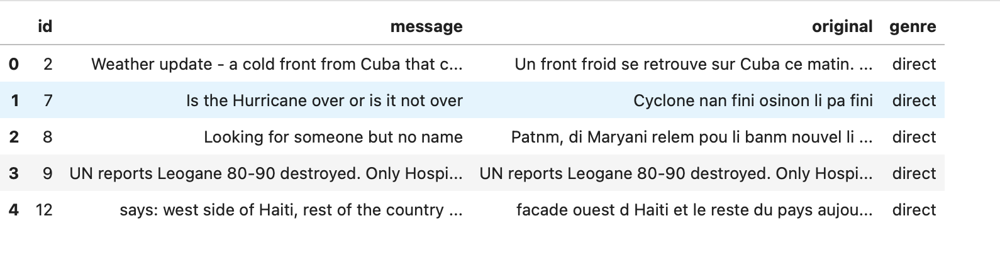
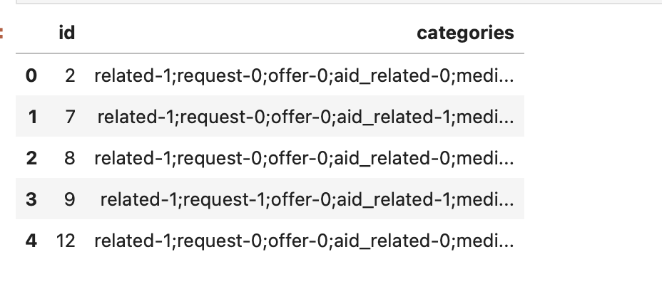
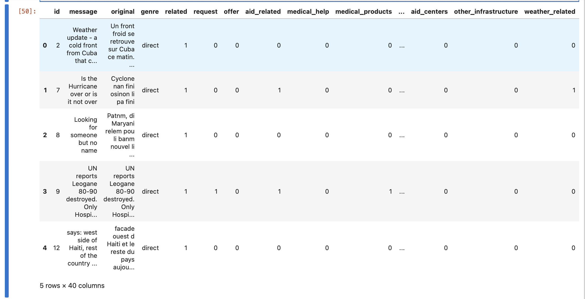
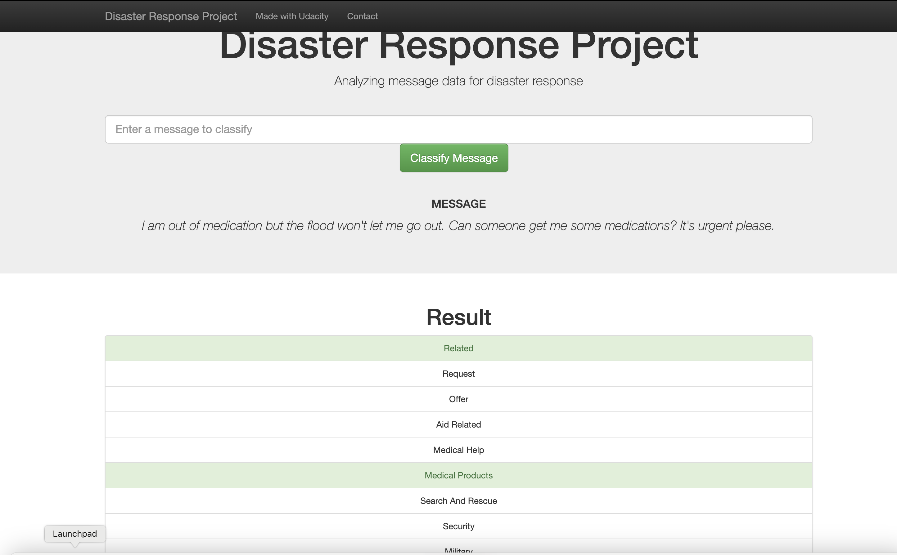

# Disaster Response Pipeline Project
### Description
This project uses machine learning to classify messages people in distress needs post on a disaster response website. When a message is posted, it classifies the category of the message so that request can be appropriately handled.

### Project Files
There are three parts to this project which have been separated into three folders:

**data**: this folder contins the data files needed for our anlaysis and the scripts for data cleaning. In the data folder, we have the following files:

- disaster_messages.csv: This file contains messages of disaster or stress situations. 

- disaster_categories.csv: This file contains the categories of messages in the disaster_messages file

- process.py: This file contains data cleansing scripts for our data. In this script, we created a binary classification for message categories and merged messages and categories together. We also dropped rows that contains non binary classifications. We loaded the clean data into a SQLite database table. 

**models**: 
- train_classifier.py: This file contains the model we used to classify our messages. Data is loaded from a SQLite database and a model is created for classification. In the model we used feature union create two features for our messages. We used GridSearch to tune our parameters and we exported our model as a pickle file.
- custom_transformer.py: This file contains a class that we used as a feature in our model. The class checks if the first lematized word in a message us true or false

**app**
- template: This folder conains the html scripts for our web page
- run.py: This is the flask script that handles routing within our webpage

### Installation
Most of the libraries needed comes pre-installed with python but some other installations are needed:
-   SQLAlchemy: `pip install SQLAlchemy`
-   nltk: `pip install --user -U nltk`
-   plotly: `pip install plotly`
### Instructions:
1. Run the following commands in the project's root directory to set up your database and model.

    - To run ETL pipeline that cleans data and stores in database
        `python data/process_data.py data/disaster_messages.csv data/disaster_categories.csv data/DisasterResponse.db`
    - To run ML pipeline that trains classifier and saves
        `python models/train_classifier.py data/DisasterResponse.db models/classifier.pkl`

2. Go to `app` directory: `cd app`

3. Run your web app: `python run.py`

4. Click the `PREVIEW` button to open the homepage
